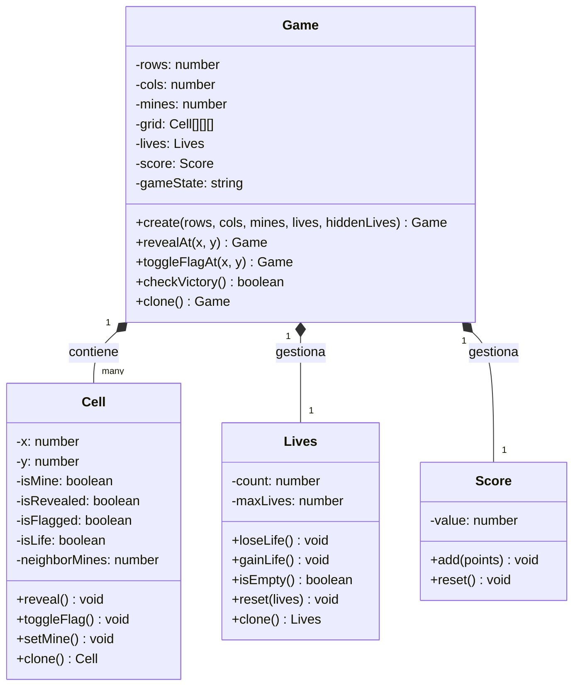

# Trabajo Práctico Integrador - Buscaminas
## Paradigmas de la Programación

Este proyecto consiste en una implementación del clásico juego **Buscaminas** utilizando **React** y **TypeScript**, aplicando conceptos del paradigma **Orientado a Objetos** para la lógica del juego y **Programación Funcional/Declarativa** para la interfaz de usuario.

---

## 🏗️ Arquitectura Orientada a Objetos

### Diagrama de Clases

La implementación del presente proyecto se fundamenta en una arquitectura orientada a objetos que separa claramente las responsabilidades mediante clases especializadas, siguiendo los principios fundamentales del paradigma OOP.



### Aplicación de Principios del Paradigma Orientado a Objetos

#### 1. **Encapsulación**

El principio de encapsulación se aplica consistentemente en todas las clases del sistema. Cada entidad mantiene su estado interno como propiedades privadas y expone únicamente métodos públicos para su manipulación controlada:

- **`Cell`**: Encapsula el estado de una celda individual (mina, revelada, bandera) y proporciona métodos específicos para su modificación.
- **`Lives`**: Gestiona el contador de vidas del jugador, implementando validaciones internas para garantizar la integridad del estado.
- **`Score`**: Controla el sistema de puntuación mediante una interfaz pública restringida.
- **`Game`**: Actúa como clase orquestadora, encapsulando la lógica completa del juego y las reglas de negocio.

#### 2. **Composición sobre Herencia**

El diseño arquitectónico privilegia la composición como mecanismo de reutilización de código. La clase `Game` se compone de:

- Una matriz bidimensional de objetos `Cell` que representa el tablero de juego
- Una instancia de `Lives` para la gestión del sistema de vidas
- Una instancia de `Score` para el control del puntaje

Esta estructura compositiva permite que cada componente sea independiente, favoreciendo la cohesión y reduciendo el acoplamiento entre módulos.

#### 3. **Inmutabilidad (Integración Funcional-OOP)**

Para garantizar la compatibilidad con el modelo de renderizado de React, se implementa un patrón de inmutabilidad en las operaciones de modificación de estado:

- Los métodos `revealAt()` y `toggleFlagAt()` no alteran la instancia actual del objeto.
- En su lugar, retornan una nueva instancia con el estado actualizado.
- Este enfoque permite que el framework detecte cambios de manera eficiente mediante comparación de referencias.

```typescript
// Implementación del patrón de inmutabilidad
revealAt(x: number, y: number): Game {
  const game = this.clone(); // Creación de nueva instancia
  // ... procesamiento de lógica de revelación
  return game; // Retorno de instancia modificada
}
```

#### 4. **Separación de Responsabilidades (MVC)**

La arquitectura implementa el patrón Modelo-Vista-Controlador, estableciendo una clara separación entre capas:

- **Modelo** (`Game`, `Cell`, `Lives`, `Score`): Contiene la lógica de negocio pura, independiente de la interfaz de usuario.
- **Vista** (Componentes React): Responsable exclusivamente del renderizado visual y la captura de eventos de usuario.
- **Controlador** (`App.tsx`): Actúa como mediador entre el modelo y la vista, gestionando el flujo de control del juego.

Esta separación proporciona los siguientes beneficios:

- **Testabilidad**: La lógica del dominio puede ser verificada mediante pruebas unitarias sin dependencias de UI.
- **Mantenibilidad**: Las modificaciones en la interfaz no impactan la lógica de negocio y viceversa.
- **Escalabilidad**: Facilita la incorporación de nuevas funcionalidades mediante extensión modular.

### Flujo de Interacción del Sistema

El flujo de ejecución del sistema sigue el siguiente proceso secuencial:

1. **Captura de Evento**: El usuario interactúa con una celda en la capa de presentación.
2. **Propagación**: El componente `Cell` captura el evento y lo propaga al controlador `App.tsx`.
3. **Invocación del Modelo**: El controlador invoca el método correspondiente del modelo (`game.revealAt(x, y)`).
4. **Procesamiento de Lógica de Negocio**: La clase `Game` ejecuta:
   - Clonación del estado actual para preservar inmutabilidad
   - Revelación de la celda seleccionada
   - Actualización de las instancias `Lives` y `Score` según corresponda
   - Verificación de condiciones de victoria o derrota
5. **Retorno de Estado**: El modelo retorna una nueva instancia con el estado actualizado.
6. **Actualización de Estado**: El controlador actualiza el estado mediante `setGame(newGame)`.
7. **Re-renderizado**: React detecta el cambio de referencia y ejecuta el ciclo de renderizado de la vista.

---

### 🚀 Inicialización del Proyecto

Para ejecutar el proyecto localmente, sigue estos pasos:

1.  **Instalar dependencias**:
    Asegúrate de tener [Node.js](https://nodejs.org/) instalado. Luego, ejecuta en la terminal:
    ```bash
    npm install
    ```

2.  **Ejecutar el servidor de desarrollo**:
    ```bash
    npm run dev
    ```

3.  **Abrir en el navegador**:
    El servidor iniciará generalmente en `http://localhost:5173/`.

---

### 📂 Estructura del Proyecto

El código fuente se encuentra en la carpeta `src/` y se divide principalmente en dos módulos: **Lógica del Juego** (`game/`) y **Componentes de UI** (`components/`).

#### 1. Lógica del Juego (`src/game/`)
Aquí reside el modelo de dominio, encapsulando el estado y el comportamiento del juego bajo el paradigma Orientado a Objetos.

*   **`Cell.ts`**:
    *   **Rol**: Representa una celda individual del tablero.
    *   **Responsabilidad**: Mantiene el estado interno de la celda (`isMine`, `isRevealed`, `isFlagged`, `neighborMines`) y expone métodos para modificarlo (`reveal()`, `toggleFlag()`, `setMine()`). Encapsula la lógica propia de la celda.

*   **`Board.ts`**:
    *   **Rol**: Representa el tablero de juego completo.
    *   **Responsabilidad**: Gestiona la matriz de celdas (`grid`). Se encarga de la inicialización, colocación aleatoria de minas, cálculo de vecinos, y algoritmos como el *Flood Fill* (expansión automática).
    *   **Inmutabilidad**: Para integrarse correctamente con React, los métodos que modifican el estado del tablero (`revealAt`, `toggleFlagAt`) retornan una **nueva instancia** de `Board` (patrón inmutable), permitiendo que React detecte los cambios y renderice de nuevo.

#### 2. Componentes de Interfaz (`src/components/`)
Estos componentes son responsables de la representación visual (View) y de capturar la interacción del usuario, delegando la lógica al modelo (`game/`).

*   **`Board.tsx`**:
    *   **Rol**: Renderiza la cuadrícula del tablero.
    *   **Responsabilidad**: Recibe la instancia de `Board` y dibuja las filas y columnas. También maneja la lógica de **zoom automático** para adaptar el tablero a pantallas pequeñas sin deformarlo y contiene el componente `LivesDisplay`.

*   **`Cell.tsx`**:
    *   **Rol**: Renderiza una celda individual.
    *   **Responsabilidad**: Muestra el estado visual de la celda (mina, número, bandera o vacía) utilizando iconos de la librería `lucide-react`. Aplica estilos condicionales (colores, animaciones) según el estado.

*   **`LevelSelector.tsx`**:
    *   **Rol**: Menú de selección de dificultad.
    *   **Responsabilidad**: Permite al usuario elegir entre niveles predefinidos (Principiante, Intermedio, Experto) o uno Personalizado.

*   **`LivesDisplay.tsx`**:
    *   **Rol**: Contador de vidas visual.
    *   **Responsabilidad**: Muestra las vidas restantes utilizando corazones. Implementa animaciones CSS personalizadas para cuando se pierde una vida (el corazón "tiembla y cae").

#### 3. Controlador Principal (`src/App.tsx`)
*   **Rol**: Componente raíz y orquestador.
*   **Responsabilidad**:
    *   Mantiene el estado global de la aplicación: instancia del `Board`, vidas, nivel actual, estado de victoria/derrota.
    *   Vincula la lógica del juego con la interfaz: recibe los eventos de clic de los componentes y llama a los métodos correspondientes del objeto `Board`.
    *   Gestiona el flujo del juego (Game Loop): verifica condiciones de victoria/derrota tras cada movimiento.

---

### 🎨 Estética y Diseño
El proyecto cuenta con una estética **"Retro Gamer 80s"**, caracterizada por:
*   Tipografías monoespaciadas.
*   Colores de alto contraste (Verde Neón sobre fondo oscuro).
*   Sombras duras (pixel-art style) en botones y contenedores.
*   Animaciones CSS para interactividad y feedback visual.

---

### 🛠 Tecnologías Utilizadas
*   **React**: Librería para la construcción de la UI.
*   **TypeScript**: Superset de JavaScript para tipado estático y mayor robustez.
*   **Tailwind CSS**: Framework de utilidades para el estilizado rápido y responsivo.
*   **Lucide React**: Librería de iconos vectoriales.
*   **Vite**: Entorno de desarrollo y empaquetador.
