# Estructura del Proyecto Buscaminas

Este documento describe la estructura completa del proyecto de Buscaminas desarrollado con React, TypeScript y Vite.

## Diagrama de Estructura

```mermaid
graph TD
    Root["🎮 buscaminas/"]
    
    Root --> Config["⚙️ Configuración"]
    Root --> Src["📁 src/"]
    Root --> Public["📁 public/"]
    Root --> Docs["📁 docs/"]
    Root --> Tests["📁 tests/"]
    Root --> Build["📦 Build & Deploy"]
    
    Config --> package["package.json"]
    Config --> tsconfig["tsconfig.json"]
    Config --> vite["vite.config.ts"]
    Config --> tailwind["tailwind.config.js"]
    Config --> eslint["eslint.config.js"]
    Config --> playwright["playwright.config.ts"]
    Config --> postcss["postcss.config.js"]
    
    Src --> MainFiles["Archivos Principales"]
    Src --> Components["📁 components/"]
    Src --> Game["📁 game/"]
    Src --> Assets["📁 assets/"]
    
    MainFiles --> main["main.tsx"]
    MainFiles --> App["App.tsx"]
    MainFiles --> AppCSS["App.css"]
    MainFiles --> indexCSS["index.css"]
    
    Components --> Board["Board.tsx"]
    Components --> Cell["Cell.tsx"]
    Components --> LevelSelector["LevelSelector.tsx"]
    Components --> LivesDisplay["LivesDisplay.tsx"]
    
    Game --> Logic["Lógica del Juego"]
    Game --> TestFiles["Tests Unitarios"]
    
    Logic --> GameTS["Game.ts"]
    Logic --> CellTS["Cell.ts"]
    Logic --> LivesTS["Lives.ts"]
    Logic --> ScoreTS["Score.ts"]
    Logic --> types["types.ts"]
    
    TestFiles --> GameTest["Game.test.ts"]
    TestFiles --> LivesTest["Lives.test.ts"]
    TestFiles --> ScoreTest["Score.test.ts"]
    
    Assets --> react["react.svg"]
    
    Public --> vitesvg["vite.svg"]
    
    Docs --> documentation["documentation.md"]
    Docs --> structure["structure.md"]
    Docs --> projectstructure["project-structure.md"]
    
    Tests --> E2E["📁 e2e/"]
    E2E --> minesweeper["minesweeper.spec.ts"]
    
    Build --> dist["📁 dist/"]
    Build --> coverage["📁 coverage/"]
    Build --> playwrightreport["📁 playwright-report/"]
    Build --> testresults["📁 test-results/"]
    
    style Root fill:#4a90e2,color:#fff
    style Src fill:#50c878,color:#fff
    style Components fill:#ff6b6b,color:#fff
    style Game fill:#ffa500,color:#fff
    style Tests fill:#9b59b6,color:#fff
    style Docs fill:#3498db,color:#fff
```



## Estructura Detallada por Directorios

### 📁 Raíz del Proyecto

```
buscaminas/
├── index.html              # Punto de entrada HTML
├── package.json            # Dependencias y scripts del proyecto
├── package-lock.json       # Lockfile de dependencias
├── README.md              # Documentación principal del proyecto
└── .gitignore             # Archivos ignorados por Git
```

### ⚙️ Archivos de Configuración

```
├── tsconfig.json           # Configuración base de TypeScript
├── tsconfig.app.json       # Configuración de TypeScript para la app
├── tsconfig.node.json      # Configuración de TypeScript para Node
├── vite.config.ts          # Configuración de Vite
├── tailwind.config.js      # Configuración de Tailwind CSS
├── postcss.config.js       # Configuración de PostCSS
├── eslint.config.js        # Configuración de ESLint
└── playwright.config.ts    # Configuración de Playwright (E2E tests)
```

### 📁 src/ - Código Fuente

```
src/
├── main.tsx               # Punto de entrada de React
├── App.tsx                # Componente principal de la aplicación
├── App.css                # Estilos del componente App
├── index.css              # Estilos globales
│
├── components/            # Componentes de React
│   ├── Board.tsx         # Tablero del juego
│   ├── Cell.tsx          # Celda individual del tablero
│   ├── LevelSelector.tsx # Selector de niveles de dificultad
│   └── LivesDisplay.tsx  # Visualización de vidas restantes
│
├── game/                  # Lógica del juego (Modelo)
│   ├── Game.ts           # Clase principal del juego
│   ├── Cell.ts           # Clase de celda
│   ├── Lives.ts          # Gestión de vidas
│   ├── Score.ts          # Gestión de puntuación
│   ├── types.ts          # Tipos TypeScript compartidos
│   ├── Game.test.ts      # Tests unitarios del juego
│   ├── Lives.test.ts     # Tests unitarios de vidas
│   └── Score.test.ts     # Tests unitarios de puntuación
│
└── assets/                # Recursos estáticos
    └── react.svg         # Logo de React
```

### 📁 public/ - Archivos Públicos

```
public/
└── vite.svg              # Logo de Vite
```

### 📁 docs/ - Documentación

```
docs/
├── documentation.md       # Documentación de las clases del juego
├── structure.md          # Estructura del código
└── project-structure.md  # Este archivo - estructura del proyecto
```

### 📁 tests/ - Tests E2E

```
tests/
└── e2e/
    └── minesweeper.spec.ts  # Tests end-to-end con Playwright
```

### 📦 Directorios de Build y Reportes

```
├── dist/                  # Código compilado para producción
├── coverage/              # Reportes de cobertura de tests
├── playwright-report/     # Reportes de tests E2E
└── test-results/          # Resultados de tests de Playwright
```

## Arquitectura del Proyecto

### Patrón MVC (Model-View-Controller)

El proyecto sigue una arquitectura basada en el patrón MVC:

- **Model** (`src/game/`): Contiene la lógica del juego
  - `Game.ts`: Gestiona el estado y las reglas del juego
  - `Cell.ts`: Representa cada celda del tablero
  - `Lives.ts`: Maneja el sistema de vidas
  - `Score.ts`: Gestiona la puntuación

- **View** (`src/components/`): Componentes de React para la UI
  - `Board.tsx`: Renderiza el tablero
  - `Cell.tsx`: Renderiza cada celda
  - `LevelSelector.tsx`: Interfaz de selección de nivel
  - `LivesDisplay.tsx`: Muestra las vidas restantes

- **Controller** (`src/App.tsx`): Coordina la interacción entre Model y View

### Stack Tecnológico

- **Frontend Framework**: React 18 con TypeScript
- **Build Tool**: Vite
- **Styling**: Tailwind CSS + PostCSS
- **Testing**: 
  - Vitest (tests unitarios)
  - Playwright (tests E2E)
- **Linting**: ESLint
- **Type Checking**: TypeScript

## Scripts Disponibles

```json
{
  "dev": "vite",                    // Servidor de desarrollo
  "build": "tsc -b && vite build",  // Build de producción
  "lint": "eslint .",               // Linting del código
  "preview": "vite preview",        // Preview del build
  "test": "vitest",                 // Tests unitarios
  "test:e2e": "playwright test",    // Tests E2E
  "test:e2e:ui": "playwright test --ui"  // Tests E2E con UI
}
```

## Flujo de Datos


## Principios de Diseño

1. **Separación de Responsabilidades**: La lógica del juego está separada de la presentación
2. **Inmutabilidad**: El estado del juego se gestiona de forma inmutable
3. **Testabilidad**: Código modular con alta cobertura de tests
4. **Type Safety**: TypeScript para prevenir errores en tiempo de compilación
5. **Responsive Design**: Interfaz adaptable a diferentes tamaños de pantalla

## Convenciones de Código

- **Componentes React**: PascalCase (ej: `Board.tsx`)
- **Clases del modelo**: PascalCase (ej: `Game.ts`)
- **Archivos de test**: `*.test.ts` o `*.spec.ts`
- **Estilos**: Tailwind CSS con clases utilitarias
- **Tipos**: Definidos en `types.ts` o inline cuando son específicos
